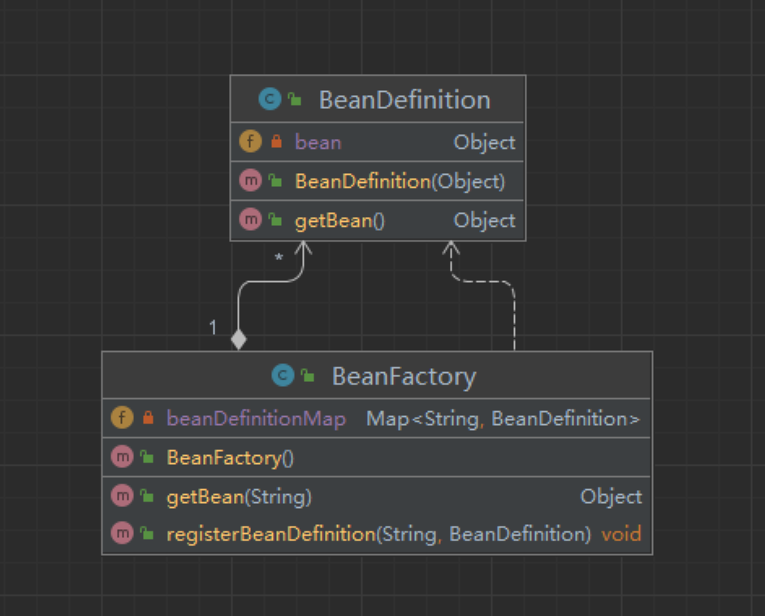

1. 初始化项目
2. 建立一个Spring Bean的容器。 
   1. BeanFactory 代表了 Bean对象的工厂.
      1. 建立一个Map 存在存放BeanName 和 Bean对象。
      2. getBean方法：用于获取bean对象。
      3. registerBeanDefinition方法：用于将实例化后的BeanDefinition对象放入Map中。
   2. BeanDefinition 用于定义 Bean 实例化信息，
      1. 现在的实现是以一个 Object 存放对象。

### 总结：
1. 该节实现了一个最简单的Spring的IOC容器。