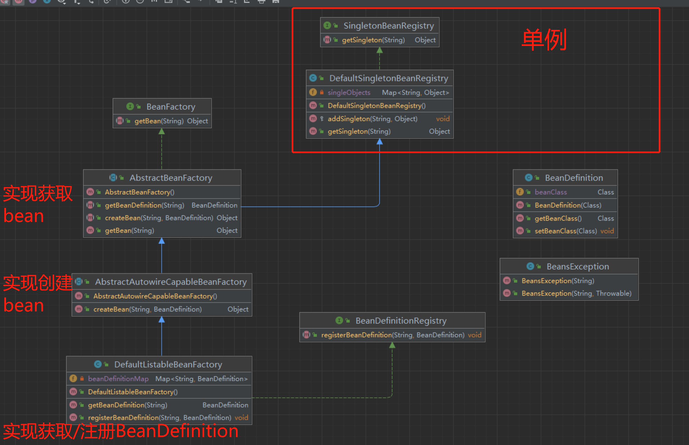

1. 修改BeanDefinition对象，保存bean对象的class对象。
2. 定义单例结构：
   1. 定义SingletonBeanRegistry接口。
      1. getSingleton方法：获取单例对象。
   2. 定义DefaultSingletonBeanRegistry类，继承SingletonBeanRegistry接口。
      1. 定义Map对象singleObjects，用于保存单例对象。
      2. 编写getSingleton方法：用于获取bean的单例对象。
      3. 编写addSingleton方法：用于新增bean对象，访问级别为protected。
3. 定义IOC框架：
   1. 定义BeanFactory接口
      1. 定义getBean方法，用于获取bean实例对象。
   2. 定义AbstractBeanFactory抽象类，实现BeanFactory接口
      1. 继承DefaultSingletonBeanRegistry对象，获取塞入和获取单例bean对象的能力。
      2. 定义抽象方法：
         1. getBeanDefinition 获取beanDefinition 对象
         2. createBean 创建bean对象。
      3. 编写getBean方法
         1. 获取单例对象。【调用DefaultSingletonBeanRegistry的getSingleton方法】
            1. 如果拿到，直接返回
            2. 如果拿不到，则执行下一步。
         2. 获取对象的 BeanDefinition 对象
            1. 如果拿不到，直接返回null
            2. 如果拿到，则执行下一步。
         3. 创建 bean对象。
   3. 定义AbstractAutowireCapableBeanFactory抽象对象。
      1. 该类继承AbstractBeanFactory，并实现了createBean方法
      2. 简单实现createBean方法：
         1. 根据传入的beanDefinition 获取class。
         2. 调用class.newInstance方法，创建bean对象。 
         3. 调用DefaultSingletonBeanRegistry的addSingleton将bean对象塞入单例容器中。
4. 核心实现类：定义 DefaultListableBeanFactory 对象。
   1. 该类继承AbstractBeanFactory对象，并实现了getBeanDefinition方法。
   2. 该类继承了BeanDefinitionRegistry接口
      1. 此接口提供了registerBeanDefinition方法，用于向注册表中注册 BeanDefinition。
   3. 该类定义Map用于保存BeanDefinition集合。
   4. registerBeanDefinition：用于注册BeanDefinition对象。
   5. getBeanDefinition：用于获取BeanDefinition对象。

### 总结：
1. 该节定义了BeanDefinition容器和单例容器。
2. 该节将创建/保存Bean对象方法分离。
3. 该节只考虑了一个简单实例化Bean对象的方法。