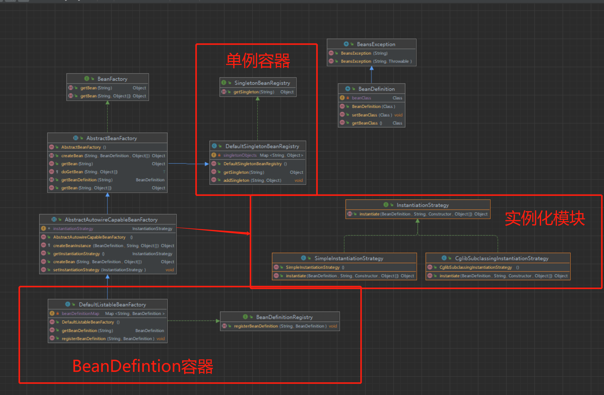

1. 修改BeanDefinition对象，保存bean对象的class对象。
2. 定义单例容器：
   1. SingletonBeanRegistry接口、DefaultSingletonBeanRegistry类。
   2. 获取/新增 Bean的单例对象。
3. 定义BeanDefinition容器：
   1. BeanDefinitionRegistry接口、DefaultListableBeanFactory类。
   2. 获取/新增BeanDefinition对象。
4. **定义实例化对象：**
   1. **定义InstantiationStrategy接口，包括instantiate方法。**
   2. **定义SimpleInstantiationStrategy对象。**
      1. **实现instantiate方法，获取对应的构造器，创建对象。**
   3. **定义CglibSubclassingInstantiationStrategy对象**
      1. **使用cglib中的Enhancer创建对象。**

5. 定义IOC容器：
   1. BeanFactory接口
      1. 定义getBean方法，用于获取bean实例对象。
      2. 定义getBean方法，获取beanName和传入的参数。
   2. 定义AbstractBeanFactory抽象类，实现BeanFactory接口
      1. 继承DefaultSingletonBeanRegistry对象，获取塞入和获取单例bean对象的能力。
      2. 定义抽象方法：
         1. getBeanDefinition 获取beanDefinition 对象
         2. createBean 创建bean对象。
      3. **将getBean方法，都调用doGetBean方法。**
         1. 调用createBean创建对象。
   3. **定义AbstractAutowireCapableBeanFactory抽象对象。**
      1. **该类继承AbstractBeanFactory，并实现了createBean方法。**
      2. **定义一个实例化对象instantiationStrategy，用于创建bean对象。**
         1. **根据传入的参数获取对应的构造方法constructorToUse。**
         2. **调用instantiationStrategy的instantiate方法创建对象。**
6. 核心实现类：定义 DefaultListableBeanFactory 对象。

### 总结：
1. 定义了实例化模块，使得IOC可以根据不同参数创建Bean对象。
