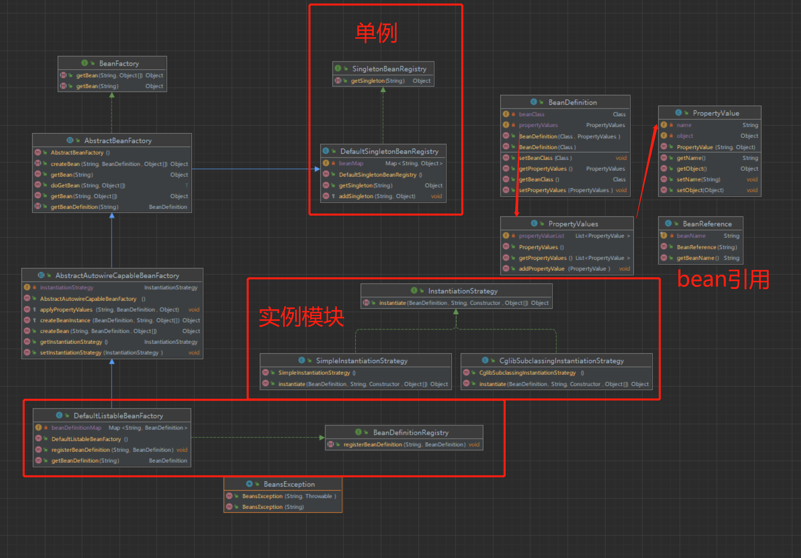

1. 修改BeanDefinition对象，保存bean的class和相关属性值propertyValues。
   1. 属性`Class`：`bean`的`class`。
   2. 定义`PropertyValues`类
      1. 定义`PropertyValue`列表用于保存`Bean`的属性。
         1. 定义`PropertyValue`类，`name`表示属性名称，`object`表示属性值。

      2. 定义添加属性`addPropertyValue`和获取属性`getPropertyValues`的方法。

2. 定义单例容器：
   1. SingletonBeanRegistry接口、DefaultSingletonBeanRegistry类。
   2. 获取/新增 Bean的单例对象。
3. 定义BeanDefinition容器：
   1. BeanDefinitionRegistry接口、DefaultListableBeanFactory类。
   2. 获取/新增BeanDefinition对象。
4. 定义实例化模块：
   1. 定义InstantiationStrategy接口、SimpleInstantiationStrategy对象、CglibSubclassingInstantiationStrategy对象。
5. 定义IOC容器：
   1. BeanFactory接口，定义getBean方法
   2. 定义AbstractBeanFactory抽象类，实现BeanFactory接口。将getBean方法，都调用doGetBean方法。
   2. **定义AbstractAutowireCapableBeanFactory抽象对象。**
      1. **该类继承AbstractBeanFactory，并实现了createBean方法。**
      2. **使用instantiationStrategy创建bean对象，调用applyPropertyValues方法塞入bean的属性**
         1. 如果是普通属性，则直接塞入。
         2. 如果是`BeanReference`属性，则调用getBean方法获取bean对象。
6. 核心实现类：定义 DefaultListableBeanFactory 对象。
  

###  总结：
1. 定义了Bean的属性模块，在创建bean对象时塞入该属性值。
