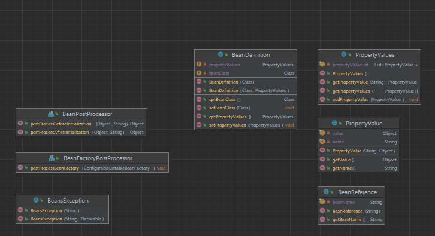
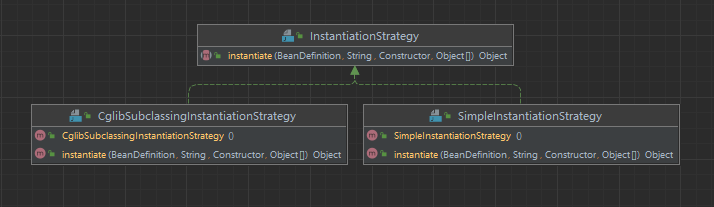
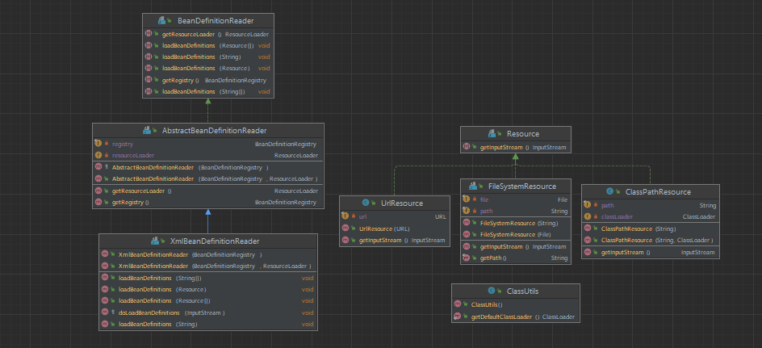
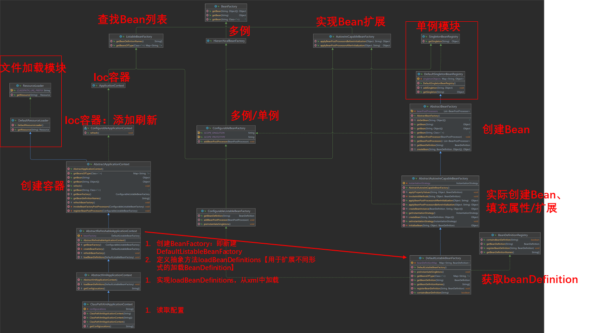

1. BeanDefinition模块。
   1. 新增了 BeanPostProcessor 接口，用于修改Bean对象的扩展点。
      1. postProcessBeforeInitialization：在 Bean 对象执行初始化方法之前，执行此方法
      2. postProcessAfterInitialization：在 Bean 对象执行初始化方法之后，执行此方法
   2. 新增了 BeanFactoryPostProcessor 接口，用于自定义修改 BeanDefinition 属性信息
      1. postProcessBeanFactory：在所有的 BeanDefinition 加载完成后，实例化 Bean 对象之前，提供修改 BeanDefinition 属性的机制
   
2. 初始化模块。
   
3. 加载模块【类、xml文件、url】
   
4. spring容器
   