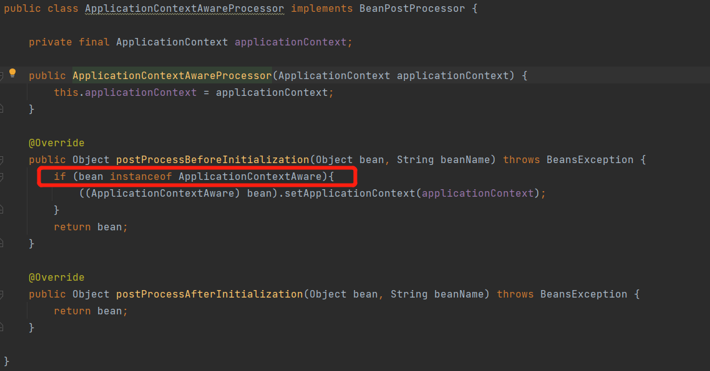

1. 新增多个Aware接口
   1. 标记类接口
      
   2. BeanNameAware接口
      
   3. BeanFactoryAware接口：实现此接口，既能感知到所属的 BeanFactory
      
   4. BeanClassLoaderAware 接口
      
   5. ApplicationContextAware 接口：实现此接口，既能感知到所属的 ApplicationContext
      
2. 初始化容器时，塞入ApplicationContextAware
   1. 在beanFactory添加BeanPostProcessor
      
   2. 新建ApplicationContextAwareProcessor类，如果bean继承了ApplicationContextAware，那么则将当前的applicationContext塞入。
      
3. 修改createBean方法调用的initializeBean方法。针对的塞入不同的数据。
   
   1. 创建对应的感知类
   