1. 容器事件和事件监听器体系
   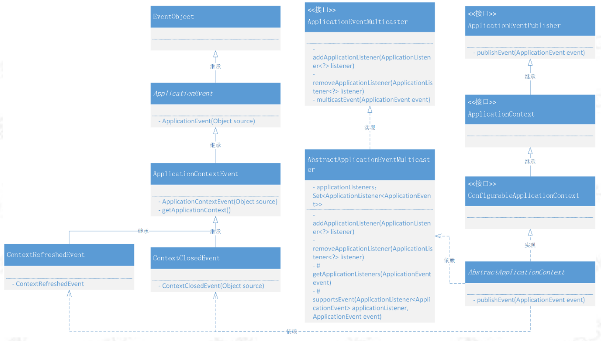
2. 事件体系
   1. 继承EventObject
      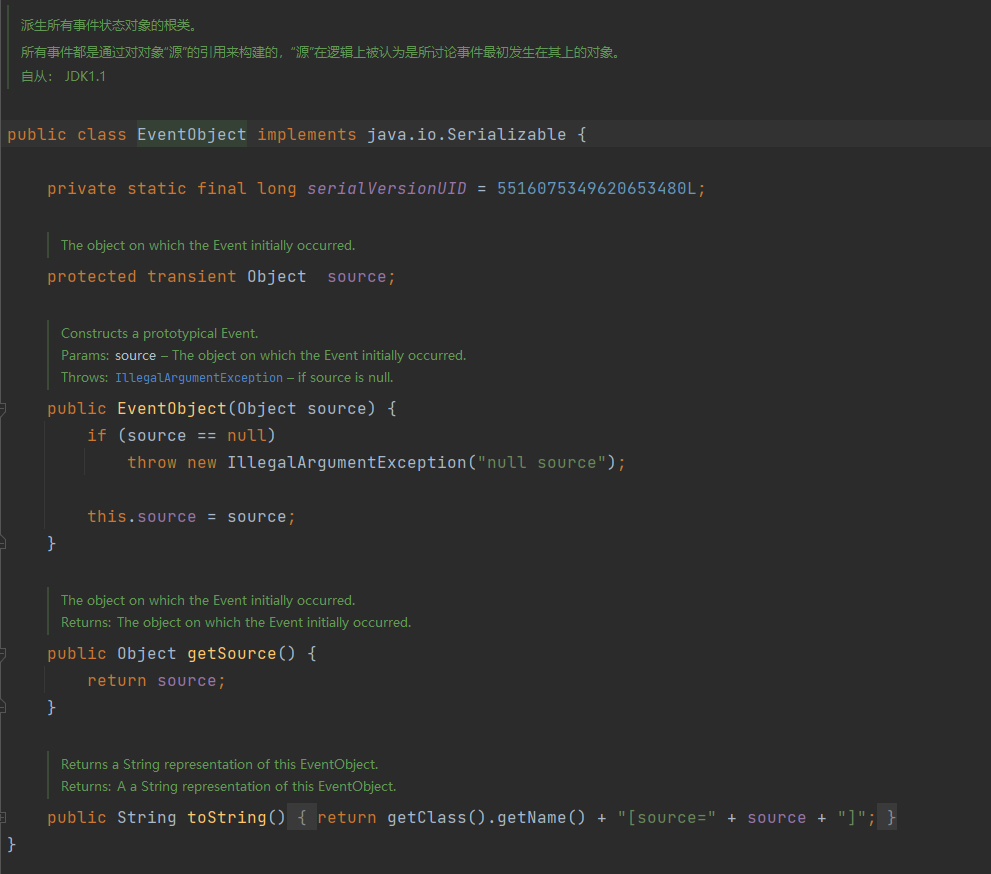
      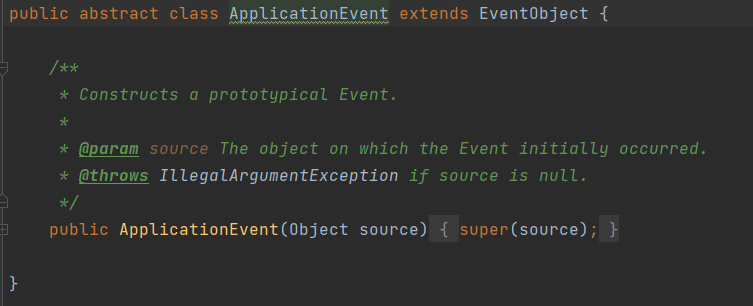
   2. 核心事件抽象类：ApplicationContextEvent
      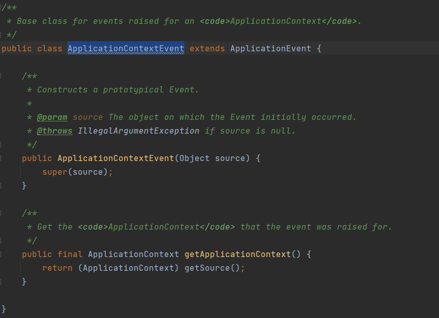
   3. 功能性事件实现类：ContextRefreshedEvent【初始化】、ContextClosedEvent【容器销毁】
      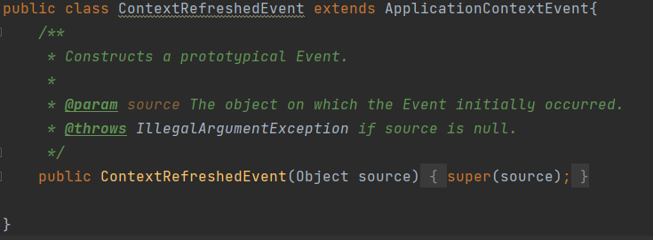
      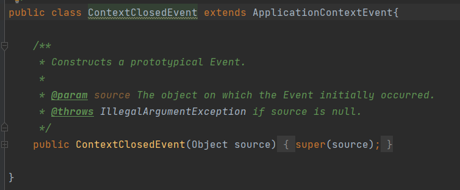
3. 监听体系
   1. 继承EventListener
      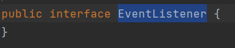
      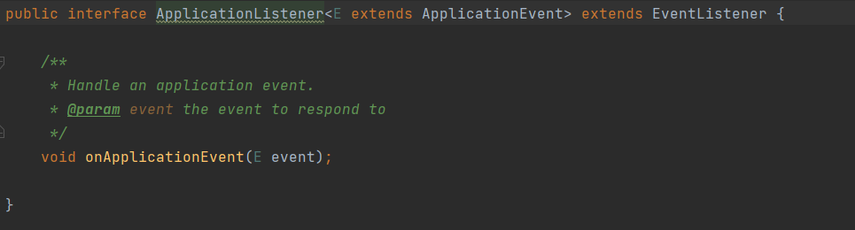
   2. 事件广播器：ApplicationEventMulticaster
      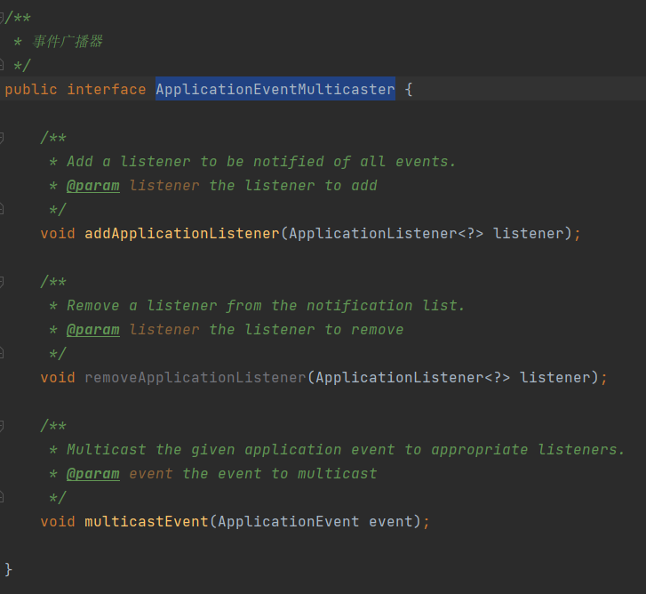
   3. 抽象类：AbstractApplicationEventMulticaster
      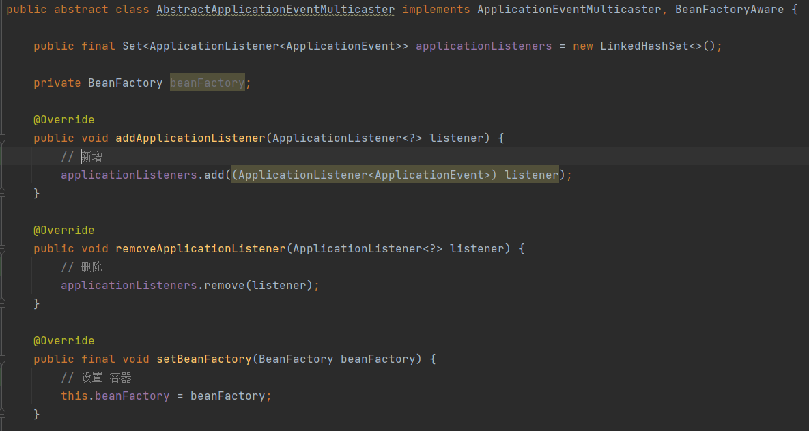
      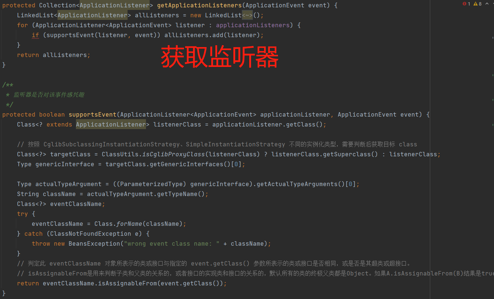
4. 修改AbstractApplicationContext中refresh方法，添加初始化事件发布者、注册事件监听器、发布容器刷新完成事件
   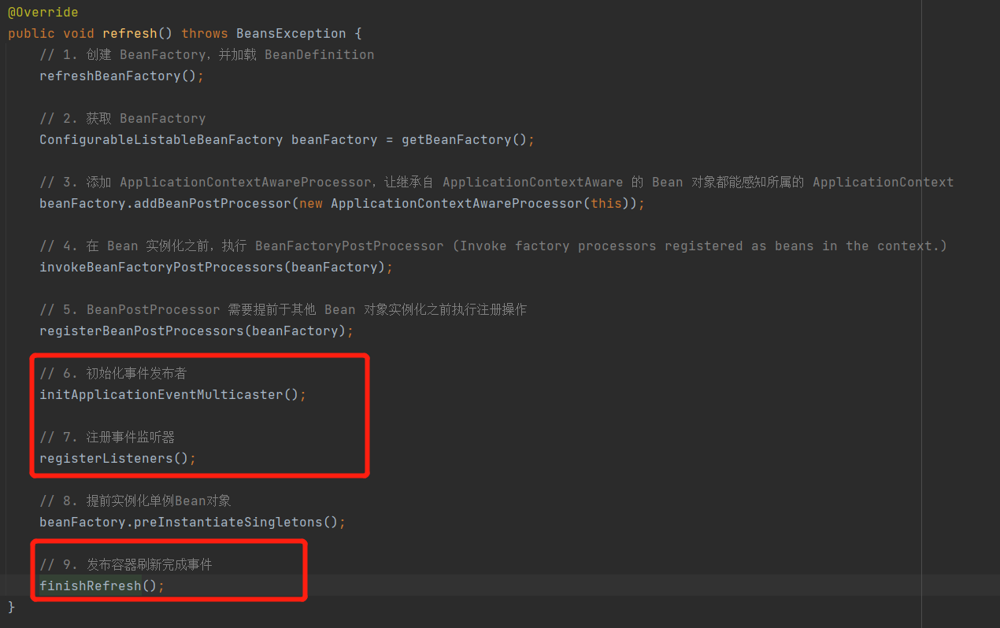
   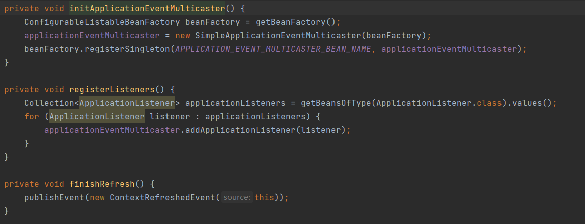

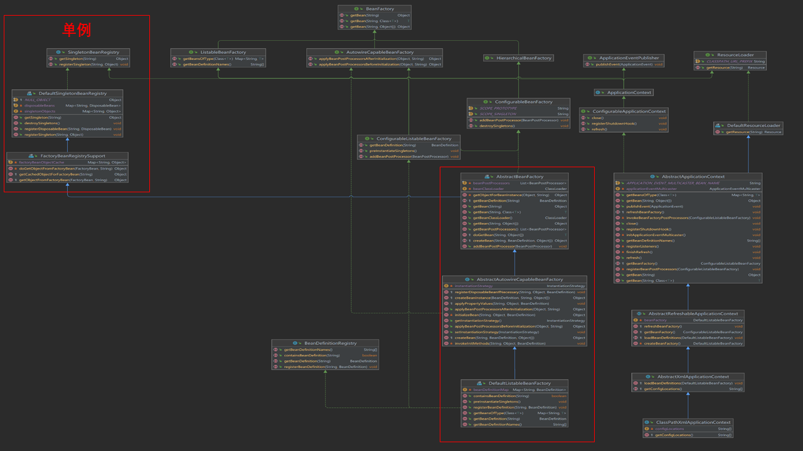
