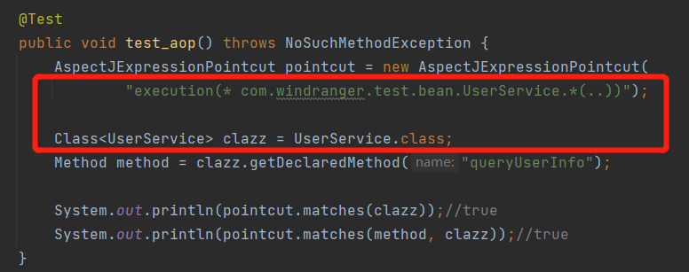
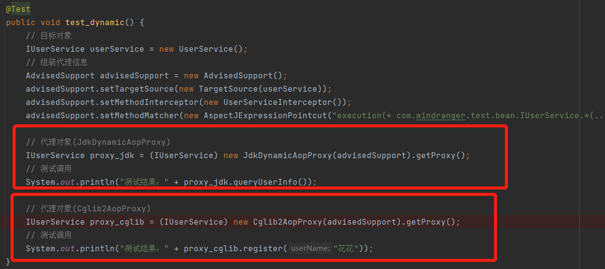

1. 定义切入点接口`Pointcut`，用于获取`ClassFilter`、`MethodMatcher`接口。

   - `ClassFilter`：类匹配，用于切点找到给定的接口和目标类。
   - `MethodMatcher`：方法匹配，找到表达式范围内匹配下的目标类和方法。

2. 实现切点表达式类`AspectJExpressionPointcut`：实现了`Pointcut`、`ClassFilter`、`MethodMatcher`接口

   

3. `AdvisedSupport`：主要是用于把代理、拦截、匹配的各项属性包装到一个类中，方便在 Proxy 实现类进行使用。 

   - `TargetSource`是一个目标对象，在目标对象类中提供 Object 入参属性，以及获取目标类 `TargetClass` 信息。
   - `MethodInterceptor`是一个具体拦截方法实现类，由用户自己实现`MethodInterceptor#invoke` 方法，做具体的处理。 
   - `MethodMatcher`是一个匹配方法的操作，这个对象由 `AspectJExpressionPointcut`提供服务。

4. `AopProxy`：定义一个`JDK`代理类。

   - `JdkDynamicAopProxy`：基于`JDK`实现的代理类。
     - `getProxy` ：获取代理对象。
     - `invoke`：方法中主要处理匹配的方法后，使用用户自己提供的方法拦截实现，做反射调用 `methodInterceptor.invoke` 。
   - `Cglib2AopProxy`：定义一个`Cglib`代理。
     - `getProxy` ：获取代理对象。

   

