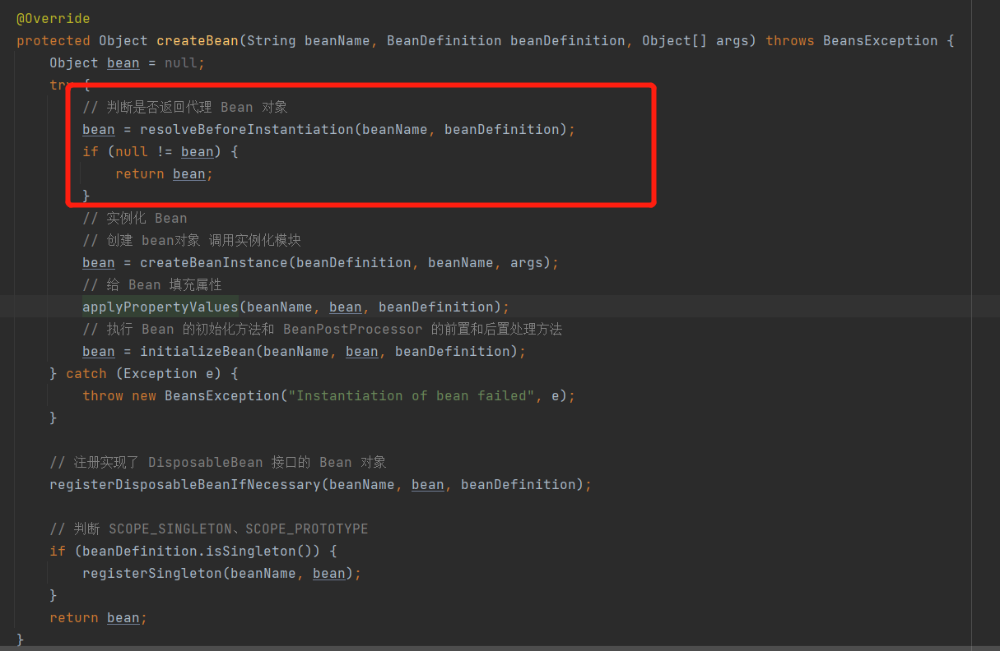

1. 定义Advice拦截链： 
   1. 在Spring框架中，Advice都是通过方法拦截器MethodInterceptor实现的。环绕Advice类似一个拦截器的链路。
2. 定义Advisor访问者：
   1. Advisor承担了Pointcut和Advice的组合，Pointcut用于获取JoinPoint，而Advice决定于JoinPoint执行什么操作。
3. AspectJExpressionPointcutAdvisor实现了PointcutAdvisor接口，把切面pointcut、拦截方法 advice 和具体的拦截表达式包装在一起。
   1. 这样就可以在xml的配置中定义一个 pointcutAdvisor 切面拦截器了。
4. MethodBeforeAdviceInterceptor实现了MethodInterceptor接口
   1. 在invoke方法中调用advice中的 before 方法，传入对应的参数信息。
5. 修改createBean方法
6. 